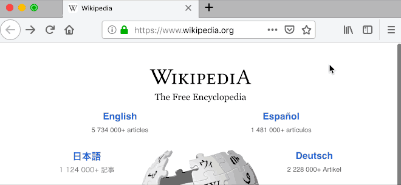

# Hide Mouse Pointer browser extension

**[Get Chrome extension](https://chrome.google.com/webstore/detail/hide-mouse-pointer/lbbedlldjinglbnfghakndfbagkolfdf)**

**[Get Firefox extension](https://addons.mozilla.org/en-US/firefox/addon/hide-mouse-pointer/)**

Hides the mouse pointer/cursor after scrolling.

The pointer is shown again after moving the mouse.

## Permissions required

- **Access your data for all websites:** Used to detect when you scroll or move the mouse on a page, and to hide the pointer.

## Privacy

No data is collected by this extension. You can [view the source code here](https://github.com/KennethSundqvist/hide-mouse-pointer-browser-extension/tree/master/src).
